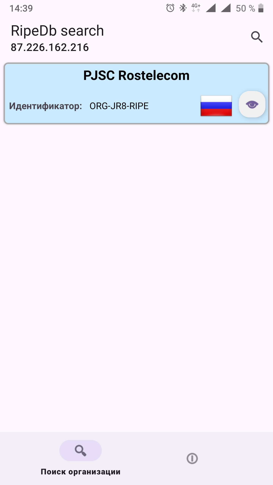

# diary_by10ama
  Приложение  "RipeDb search":
 - Аналитическое приложение, определяющее: принадлежность 
  указанного IP адреса к организации;
 - состав IP сетей организации     

  Для поиска введите наименование организации или ip-адрес. При успешном поиске отобразится результат в виде списка. 
При нажатии на элемент списка загрузится список с информацией о диапазоне адресов и об имени сети выбранного элемента.
  Все полученные данные сохраняются в локальной базе данных и будут доступны при отсутствии интернета на устройстве.
       

## Внешний вид:

